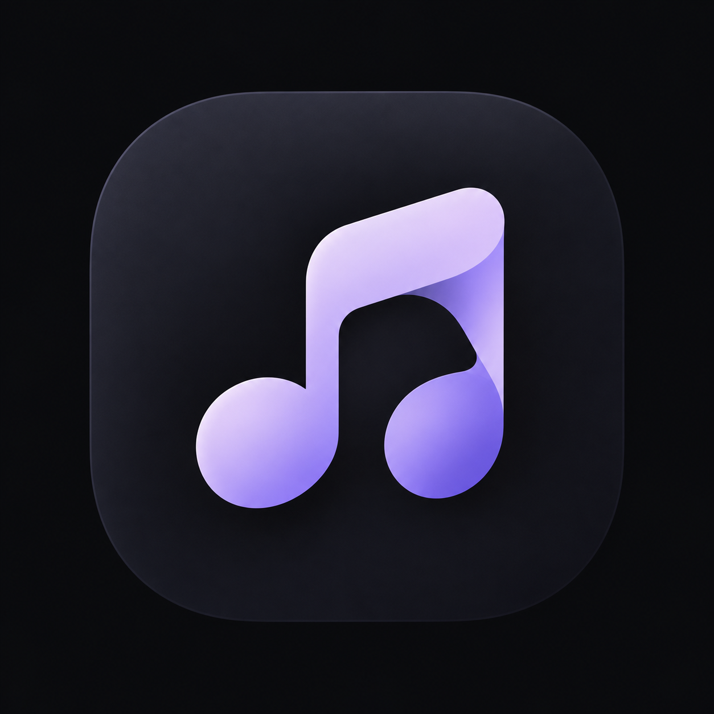
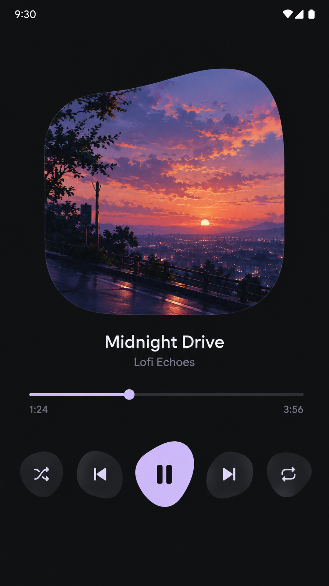

# 🎵 Music (Material 3 Expressive Android Audio Player)

<div align="center">



### **A Pure Black Minimalist Offline Audio Player with 1-Click Home Screen Playlists & Material 3 Fluid Design**

[](https://kotlinlang.org)
[](https://developer.android.com/jetpack/compose)
[](https://m3.material.io)
[](LICENSE)

[**Download Latest Release**](https://github.com/apandey-dev/Music/releases) • [**Features**](#-features) • [**Screenshots**](#-screenshots) • [**Architecture**](#-architecture--tech-stack) • [**Contributing**](#-contributing)

</div>

---

## 🌟 Key Highlight: 1-Click Home Screen Playlists & Widgets

> **Never open the app just to play your favorite track.**
> Pin any custom playlist directly to your Android Home Screen with dedicated 1-click launcher shortcuts and interactive playback widgets. Tap once from your home screen, and your music immediately starts playing in background!

---

## ✨ Features

- 🖤 **True Pitch-Black AMOLED UI (`#000000`)**: Zero battery waste on OLED/AMOLED displays with refined Samsung-style duo-tone elevated surfaces (`#141418`, `#202026`).
- 🎨 **Material 3 Expressive Organic Player**:
  - Smooth fluid / blob organic album artwork frame.
  - Expressive Pastel Lavender (`#D4C2FC`) center play/pause bean button.
  - Active visual feedback on Shuffle & Repeat modes.
  - High-precision draggable scrub slider with live timestamps.
- 💊 **Edge-to-Edge Floating Pill MiniPlayer**:
  - Attached smoothly above the navigation bar with full-width minimal margins (`3dp`).
  - Circular album art thumbnail, integrated micro-progress indicator, and responsive play/pause & skip controls.
- 📁 **Smart Folder Isolation & Privacy**:
  - Choose specific folders to scan audio from (e.g., Download, Music, Snaptube).
  - Automatically suppresses system call recordings, voice notes, and audio files smaller than 15KB or 5 seconds.
  - Supports all major audio formats: **MP3, FLAC, WAV, M4A, AAC, OGG**.
- 👆 **Samsung Style Duo-Tone Tab Bar**:
  - Seamless horizontal swipe transitions between **Songs** and **Playlists**.
  - Integrated 3-dot overflow menu for scanning and folder management.
  - Instant live search bar with zero touch flicker or rectangle highlights.
- 🔄 **Dual Slide Action Song Tiles**:
  - **Slide Right**: Instantly queue track to **Play Next**.
  - **Slide Left**: Quick **Add to Playlist / Group** bottom sheet.
- 🖼️ **2-Step Playlist Creator**:
  - Step 1: 1:1 true square banner image picker with local disk persistence.
  - Step 2: Full-screen song selector with batch select/clear actions.
- 🛡️ **Zero Startup Glitch**:
  - Pre-cached folder initialization prevents false "No Songs Found" flash on cold start.
  - Intercepted system back button in Full Player smoothly minimizes the screen to MiniPlayer without closing the app.

---

## 📱 Screenshots

<div align="center">
  <table>
    <tr>
      <td align="center">
        <br/>
        <b>Expressive Full Player</b>
      </td>
      <td align="center">
        <br/>
        <b>All Songs & Quick Search</b>
      </td>
      <td align="center">
        <br/>
        <b>Playlists & Home Shortcuts</b>
      </td>
      <td align="center">
        <br/>
        <b>Queue & Dual Slide Actions</b>
      </td>
    </tr>
  </table>
</div>

> *Tip: You can replace or add your own screenshot samples in the `screenshots/` directory.*

---

## 🛠️ Architecture & Tech Stack

```
com.amoled.music
├── data/
│   ├── backup/      # JSON-based playlist persistence across installs
│   ├── db/          # Room DB (Entities, DAOs, Database)
│   ├── model/       # Data classes (Song, Playlist, PlaybackState)
│   └── repository/  # AudioScanner, FolderManager, CallRecordingFilter
├── playback/
│   ├── MusicPlaybackService.kt  # Android Media3 MediaSession foreground service
│   └── PlaybackController.kt   # Centralized player controller & queue manager
├── ui/
│   ├── components/  # FullPlayerModal, MiniPlayer, SamsungTopTabBar, SwipeableSongItem...
│   ├── screens/     # AllTracksScreen, HomeScreen, PlaylistDetailScreen, SongPickerScreen
│   └── theme/       # Color, Theme, Type (AMOLED Duo-Tone Palette)
├── widget/          # Android AppWidgetProvider & Dynamic Home Screen Shortcut Manager
└── MainActivity.kt  # Root activity & Navigation graph
```

- **UI Framework**: 100% Jetpack Compose with Material 3 Expressive components.
- **Audio Engine**: AndroidX Media3 (`ExoPlayer`, `MediaSessionService`).
- **Database**: Room Database with Coroutines & StateFlow.
- **Image Loading**: Coil 2.6 with disk & memory caching.
- **Permissions**: Accompanist Permissions for Android 13+ `READ_MEDIA_AUDIO` & legacy storage.

---

## 🚀 Getting Started

### Prerequisites
- Android Studio Hedgehog (2023.1.1) or newer
- JDK 17
- Android SDK 34 (Minimum Android 8.0 Oreo / API 26)

### Clone & Build
```bash
# Clone the repository
git clone https://github.com/apandey-dev/Music.git

# Navigate to directory
cd Music

# Build Debug APK
./gradlew assembleDebug

# Build Release APK
./gradlew assembleRelease
```

The generated APKs will be located at:
- `app/build/outputs/apk/debug/app-debug.apk`
- `app/build/outputs/apk/release/app-release.apk`

---

## 🤝 Contributing

Contributions, bug reports, and feature requests are warmly welcomed!

1. Fork the Project
2. Create your Feature Branch (`git checkout -b feature/AmazingFeature`)
3. Commit your Changes (`git commit -m 'Add some AmazingFeature'`)
4. Push to the Branch (`git push origin feature/AmazingFeature`)
5. Open a Pull Request

Feel free to open an [Issue](https://github.com/apandey-dev/Music/issues) to report bugs or request new features.

---

## 📄 License

Distributed under the Apache 2.0 License. See `LICENSE` for more information.
